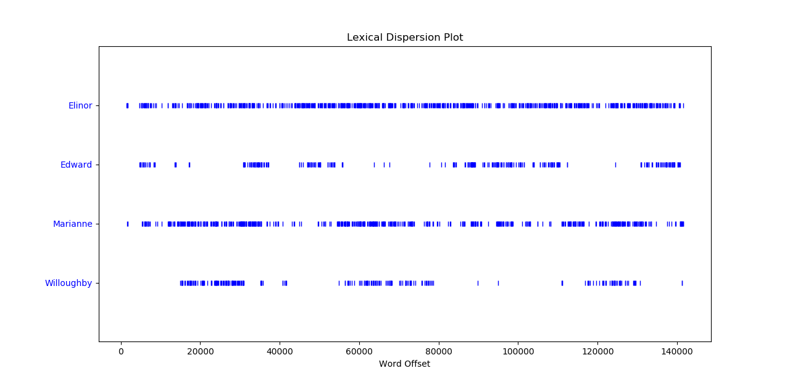

# Exercises for Assignment 1


## Problem 5

### Question: 
Compare the lexical diversity scores for humor and romance fiction in 1.1. Which genre is more lexically diverse?
#### Lexical Diversity of Various Genres in the Brown Corpus
| Genre             | Tokens | Types  | Lexical Diversity  |
| ----------------- | ------:| ------:| ------------------:|
| skill and hobbies | 82345  | 11935  | 0.145              |
| humor             | 21695  | 5017   | 0.231              |
| fiction: science  | 14470  | 3233   | 0.223              |
| press: reportage  | 100554 | 14394  | 0.143              |
| fiction: romance  | 70022  | 8452   | 0.121              |
| religion          | 39399  | 6373   | 0.162              	

### Solution
From the table above we can gleam that, among the pieces  condidered by the Brown corpus, works of humor were more lexically diverse than works of romance fiction. Assuming those pieces are representative of the genres at large, we can conclude that that humor is the more lexically diverse genre of the two. 


## Problem 6

### Question: 
Produce a dispersion plot of the four main protagonists in Sense and Sensibility: Elinor, Marianne, Edward, and Willoughby. What can you observe about the 
different roles played by the males and females in this novel? Can you identify the couples?

### Solution


Based on the lexical dispersion plots, we can draw a few inferences: 
1. Elinor's ubiquity throughout the book implicates her as the main character.
2. Marianne's near ubiquity implies she too plays a central role to the book. 
3. The overlap between Willoughby's and Marianne's hot-spots and cold-spots suggests that Marianne's presense is a near-neccessary rquirement for Willoughby's presence. This provides strong evidence that the two are a couple. 
4. Edward's hot-spots matching up with Marianne's cold-spots,  at least more than any other character in our list, implies that he and Elinor spend a fair amount of time alone. This provides strong evidence that the two are a couple.   


## Problem 17
 
### Question:
Use text9.index() to find the index of the word sunset. You'll need to insert this word as an argument between the parentheses. By a process of trial and error, 
find the slice for the complete sentence that contains this word.

### Solution:
The slice for the complete sentence is `text9[621:644]`, and the process for finding that slice is described below
```
>>> text9.index('sunset')
629
<!-- Confirming that this is the index -->
>>> text9[629]
'sunset'
<!-- Slice 10 tokens in both direction -->
>>> text9[620:640]
['PARK', 'THE', 'suburb', 'of', 'Saffron', 'Park', 'lay', 'on', 'the', 'sunset', 'side', 'of', 'London', ',', 'as', 'red', 'and', 'ragged', 'as', 'a']
<!-- Looks like 640 is approaching the end of the sentence; Not sure why we have another capitalized word at the beginning -- need more context -->
>>> text9[610:645]
['.', 'C', '.', 'CHAPTER', 'I', 'THE', 'TWO', 'POETS', 'OF', 'SAFFRON', 'PARK', 'THE', 'suburb', 'of', 'Saffron', 'Park', 'lay', 'on', 'the', 'sunset', 'side', 'of', 'London', ',', 'as', 'red', 'and', 'ragged', 'as', 'a', 'cloud', 'of', 'sunset', '.', 'It']
<!-- Ahh it was a part of the chapter title. Just count the words as needed to get exact indices -->
>>> text9[621:644]
['THE', 'suburb', 'of', 'Saffron', 'Park', 'lay', 'on', 'the', 'sunset', 'side', 'of', 'London', ',', 'as', 'red', 'and', 'ragged', 'as', 'a', 'cloud', 'of', 'sunset', '.']
```


## Problem 18

### Question:  
Using list addition, and the set and sorted operations, compute the vocabulary of the sentences sent1 ... sent8.

### Solution:
The steps we'll take are

1. Concatenate all the sents into a single sent-of-sents.
2. Lowercase all the tokens found in the sent-of-sents.
3. Create a set of all those tokens.
4. Use the len function to determine the length of that vocabulary
5. Sort that set to have a conveniently ordered vocabulary.
6. If we're feeling really stingy we can slice off the non-alphabetic tokens.

```
>>> sent_of_sents = []
>>> for i in range(1,9):
...     sent_of_sents += globals()[f'sent{i}']
>>> lowercase_sent_of_sents = [w.lower() for w in sent_of_sents]
>>> vocab_of_sents = set(lowercase_sent_of_sents)
>>> vocab_sorted = sorted(vocab_of_sents)
>>> vocab_sorted
['!', ',', '-', '.', '1', '25', '29', '61', ':', '[', ']', 'a', 'and', 'arthur', 'as', 'attrac', 'been', 'beginning', 'board', 'call', 'citizens', 'clop', 'created', 'dashwood', 'director', 'discreet', 'earth', 'encounters', 'family', 'fellow', 'for', 'god', 'had', 'have', 'heaven', 'house', 'i', 'in', 'ishmael', 'join', 'king', 'lady', 'lol', 'long', 'male', 'me', 'nonexecutive', 'nov.', 'of', 'old', 'older', 'people', 'pierre', 'pming', 'problem', 'representatives', 'scene', 'seeks', 'senate', 'settled', 'sexy', 'single', 'sussex', 'the', 'there', 'to', 'vinken', 'whoa', 'will', 'wind', 'with', 'years']
>>> len(vocab_sorted)
72
<!-- If we want to be stingy we can slice off the  non-alphabetic tokens -->
>>> vocab_sorted.index(']')
10
>>> vocab_true = vocab_sorted[11:]
>>> vocab_true 
['a', 'and', 'arthur', 'as', 'attrac', 'been', 'beginning', 'board', 'call', 'citizens', 'clop', 'created', 'dashwood', 'director', 'discreet', 'earth', 'encounters', 'family', 'fellow', 'for', 'god', 'had', 'have', 'heaven', 'house', 'i', 'in', 'ishmael', 'join', 'king', 'lady', 'lol', 'long', 'male', 'me', 'nonexecutive', 'nov.', 'of', 'old', 'older', 'people', 'pierre', 'pming', 'problem', 'representatives', 'scene', 'seeks', 'senate', 'settled', 'sexy', 'single', 'sussex', 'the', 'there', 'to', 'vinken', 'whoa', 'will', 'wind', 'with', 'years']
>>> len(vocab_true)
61
```


## Problem 19

### Question: 
What is the difference between the following two lines? Which one will give a larger value? Will this be the case for other texts?
```
>>> sorted(set(w.lower() for w in text1)) 
>>> sorted(w.lower() for w in set(text1))
```

### Solution: 
The first line creates a sorted set of all the tokens occuring in the text, lowercasing before creating a set so as to avoid adding terms multiple times due to the case-sensitivity of the `set` function. 

The second line creates a sorted list of the lowercase version of all unique, case-sensitive tokens in the text. Since we lowercase the terms after creating a set, our sorted list could have multiple instances of the same lowercase token, since before lowercainge they would have been considered unique terms according to the `set` function.

In order to illustrate the difference in the operations, we can look at the way both operations process the term 'in', which likely occurs in both capitalized and lowercased forms.
```
<!-- Set 1: produces a sorted set of unique instances of words, ignoring case -->
>>>  sorted(set(w.lower() for w in text1)).index('in')
7722
>> sorted(set(w.lower() for w in text1))[7720:7725]
['impute', 'imputed', 'in', 'inability', 'inaccessible']

<!-- Set 2: produces a sorted set of unique words while being case-sensitive, but lowercases those spelling after creating a set -->
>>> sorted(w.lower() for w in set(text1)).index('in')
8625
>>> sorted(w.lower() for w in set(text1))[8622:8628]
['imputation', 'impute', 'imputed', 'in', 'in', 'in']
```

As we can see in the chunk of code above, the second set includes duplicate entries for the same terms since they occured with different spellings in the initial test. 